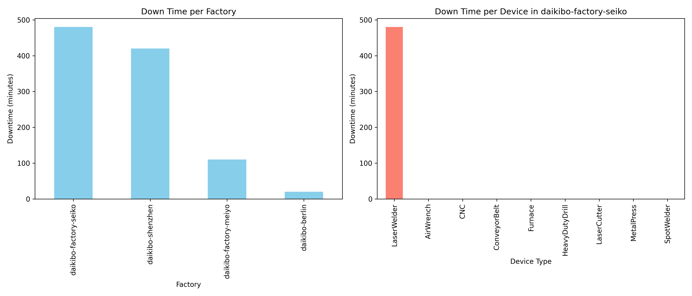
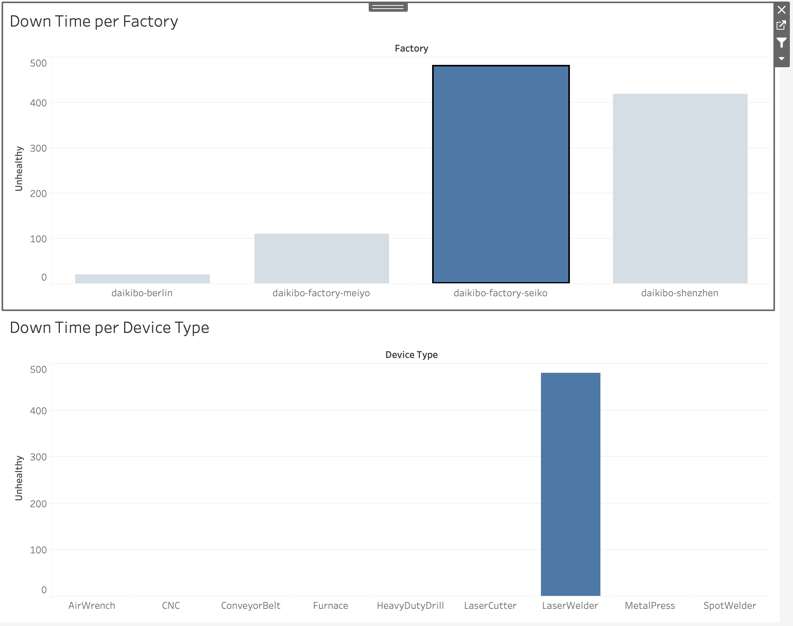

# Deloitte Data Analytics Virtual Experience - Task 1

## 📌 Project Overview
This project is based on the Deloitte Data Analytics Virtual Experience on Forage.  
The task involved analysing telemetry data collected from Daikibo's four factories across the globe.  
I extended the original task by performing additional analysis using Python and creating visualisations to better understand machine downtime patterns.

## 🎯 Objectives
- Identify which factory had the most machine downtime.
- Determine which device type contributed the most to downtime in that factory.
- Reproduce the analysis performed in Tableau using Python for better reproducibility and further insights.

## 🛠️ Tools & Skills
- Python (Pandas, Matplotlib)
- Jupyter Notebook
- JSON data handling
- Data Cleaning
- Data Analysis & Visualisation

## 📊 Analysis Summary
- **Factory with the most downtime:** `Daikibo Factory Seiko (Osaka, Japan)`
- **Device type with the most downtime in that factory:** `LaserWelder`
- **Visualisations included:**
  1. **Python analysis** – combined bar charts showing downtime per factory and per device type in the worst-performing factory (`factory_device_downtime_py.png` in `/images`)
  2. **Tableau Dashboard** – interactive dashboard created in Tableau; screenshot included in `/images/task1_tab.png`

### Key Insights
- Most downtime occurs in Seiko, indicating potential maintenance or operational issues in that location.
- LaserWelder machines are the most failure-prone in Seiko, suggesting focused attention for operational improvement.
- These insights can help management prioritise maintenance efforts to minimise production delays.

## 💡 What I Learned
- How to flatten nested JSON and clean raw data.
- How to calculate downtime and aggregate metrics for analysis.
- How to create clear and informative visualisations.
- How to reproduce Tableau analysis in Python for better flexibility.
